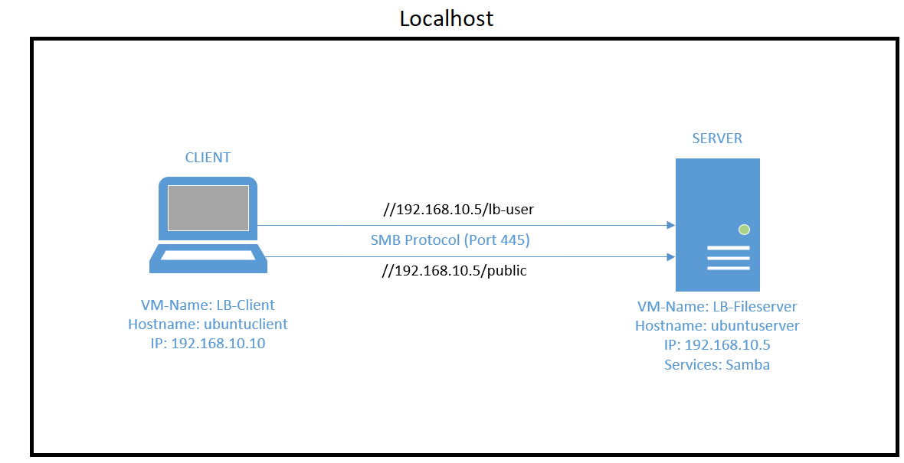

# M300 LB2, Samba Fileserver mit Vagrant

## Inhaltsverzeichnis

- [Einleitung](#einleitung)
    - [Voraussetzungen](#voraussetzungen)
- [Wie sieht die Umgebung aus?](#wie-sieht-die-umgebung-aus)
	- [Shares](#shares)
- [Umgebung steuern](#umgebung-steuern)
    - [Hochfahren](#hochfahren)
    - [Herunterfahren](#herunterfahren)
    - [Umgebung löschen](#umgebung-löschen)
    - [Befehl-Tabelle Vagrant](#befehl-tabelle-vagrant)
- [Via SSH auf die VMs zugreifen](#via-ssh-auf-die-vms-zugreifen)
- [Benutzernamen und Passwörter](#benutzernamen-und-passwörter)
    - [SSH](#ssh)
    - [Samba](#samba)
- [Zugreifen auf den privaten Share](#zugreifen-auf-den-privaten-share)
- [Ordner erstellen und anzeigen](#ordner-erstellen-und-anzeigen)
- [Code](#code)
- [Exit](#exit)
- [Quellen](#quellen)

---

## Einleitung

In dieser LB2 vom Modul 300 (Plattformübergreifende Dienste in ein Netzwerk integrieren) schauen wir Vagrant an. Die Dokumentation schreiben wir mit Markdown. Das Ziel der LB2 ist es, anhand von Vagrant, eine Service Funktion mit mehreren VMs oder Services aufzusetzen. In unserem Fall haben wir zwei VMs aufgesetzt. Eine Servermaschine für den SMB Fileserver und einen Client, der darauf zugreifen kann. Der Dienst ermöglicht Geräten, innerhalb eines Netzwerkes, auf geteilte Dateien zuzugreifen und Berechtigungen über Ordner/Dateien zu kontrollieren.

>### Voraussetzungen
- Die neuste Version von Virtualbox muss installiert sein
- Auf Virtualbox dürfen keine VMs vorhanden sein, die entweder "LB-Fileserver" oder "LB-Client" heissen
- Vagrant muss installiert sein
- PC mit min. 8 GB freiem RAM und ca. 20 GB freiem Speicher

---

## Wie sieht die Umgebung aus?

Die Umgebung beinhaltet einen Fileserver, welcher zwei SMB Shares im ganzen beinhaltet. Ebenfalls gibt es einen Client, mit welchen man auf die Shares zugreifen kann.

### Spezifikationen
- **Localhost:**
    - Provider: VirtualBox 6.1
    - Networt for VMs: Private Network
- **Client:**
    - OS: ubuntu/xenial64
    - RAM: 4096MB
    - CPU Cores: 4
- **Server:**
    - OS: ubuntu/xenial64
    - RAM: 2048MB
    - CPU Cores: 2

### Shares
- **LB-User Share:**
auf diesen Share kann nur der User lb-user zugreifen. Dazu braucht man dessen Benutzernamen und Passwort und jedem anderen wird der Zugriff verwährt. In diesem Share wird nur der lb-user Dateien erstellen und löschen können und überhaupt auf den Share zugreifen können.
> **NOTE:** Username und Passwort werden noch angegeben

- **Public Share:**
auf diesen Share kann jeder zugreifen. Hier wird kein Account benötigt und jeder hat die Authorität dazu, Dateien und Ordner in diesem Share zu löschen

---

## Umgebung steuern

### Hochfahren:

Um die Umgebung hoch zufahren, muss man im Terminal im **gleichen Ordner wie das Vagrantfile** sein und **vagrant up** eingeben. Dies dauert eine Weile, da es die Nötigen Daten herunterladet und die VMs erstellt und konfiguriert.

### Herunterfahren:

Wenn man nun die Umgebung herunterfahren möchte, muss man im Terminal im **gleichen Ordner wie das Vagrantfile** sein und **vagrant halt** eingeben.

### Umgebung vom Gerät löschen:

Um die Umgebung vom Gerät nun zu löschen, muss man im Terminal im **gleichen Ordner wie das Vagrantfile** sein und den Befehl **vagrant destroy** eingeben. 
> **NOTE:** Man muss bei den Maschinen die beide Male **"y"** eingeben, um zu bestätigen, dass man die VMs auch wirklich löschen will.

### Befehl-Tabelle Vagrant:

|Befehl    |Command (im Terminal)                    |
|-------------------------|--------------------------|
|hochfahren / erstellen   |`vagrant up`              |
|herunterfahren           |`vagrant halt`            |
|löschen                  |`vagrant destroy`         |

 
## Via SSH auf die VMs zugreifen:

Um auf die einzelnen VMs zuzugreifen, muss man lediglich im Terminal im **gleichen Ordner wie das Vagrantfile** sein und den Befehl **vagrant ssh "Maschine"** eingeben.

|Welche Maschine  |Command (im Terminal)              |
|-----------------|-----------------------------------|
|Fileserver       |`vagrant ssh ubuntuserver`         |
|Client           |`vagrant ssh ubuntuclient`         |

## Benutzernamen und Passwörter

### SSH

Auf dem LB-Fileserver sowie auf dem LB-Client sind die SSH User Vagrant.
- Benutzername: vagrant
- Passwort: vagrant

### SAMBA

Um auf den privaten Samba Share zugreifen zu können, braucht es einen privaten Benutzer: "lb-user"
- Benutzername: lb-user
- Passwort: password 

## Zugreifen auf den privaten Share

Zugreifen auf den Samba Share via Ubuntuclient Terminal:

|welcher Share    |Command (im Terminal)                                    |
|-----------------|---------------------------------------------------------|
|privaten Share   |`smbclient //192.168.10.5/lb-user -U lb-user`              |
|public Share     |`smbclient //192.168.10.5/public`                        |
|Allgemein        |`smbclient //*IP Adresse*/*Ordner* -U *Benutzername*`    |

## Ordner erstellen und anzeigen
Wenn wir Zugriff auf die Shares haben, können wir nun darauf Ordner erstellen.

|Ziel    |Command (im Terminal)                                    |
|-----------------|---------------------------------------------------------|
|Ordner erstellen               |`mkdir "Ordnername"`              |
|Objekte im Ordner anzeigen     |`ls`                              |

## Code
---
### Vagrant

Hier startet die Konfiguration der VMs.

>Vagrant.configure("2") do |config|

Wir definieren nun den Namen, um mit SSH zuzugreifen, den Hostnamen und das OS.

>config.vm.define "ubuntuserver" do |fileserver|

>fileserver.vm.hostname = "ubuntuserver"

>fileserver.vm.box = "ubuntu/xenial64

Nun erstellen wir das Netzwerk und vergeben die IP-Adresse.
>fileserver.vm.network "private_network", ip: "192.168.10.5"

Wir geben den Provider an, welcher Name beim Provider dargestellt wird und ob die VM ein GUI hat.
>fileserver.vm.provider "virtualbox" do |vb|

>vb.gui = false

>vb.name = "LB-Fileserver"

Hier sind die Spezifikationen.
>vb.memory = "2048"
>vb.cpus = "2"

Wir verlinken auf das File, welches die Installationen in der VM macht.
>fileserver.vm.provision "shell", path: "provision/serverdeployment.sh"

---

## Exit

### Aus Sambashare

Um den Share zu verlassen, in welchen man sich eingeloggt hat, muss man nur einen Befehl eingeben:
> exit

### Aus SSH

Um die SSH Verbindung (im Terminal von z.B. Visual Studio Code,...) zu trennen, muss man lediglich einen Befehl eingeben:
> exit

## Quellen
[Samba installation](https://help.ubuntu.com/community/How%20to%20Create%20a%20Network%20Share%20Via%20Samba%20Via%20CLI%20(Command-line%20interface/Linux%20Terminal)%20-%20Uncomplicated,%20Simple%20and%20Brief%20Way!)

[Markdown Syntax](https://www.markdownguide.org/basic-syntax/)
